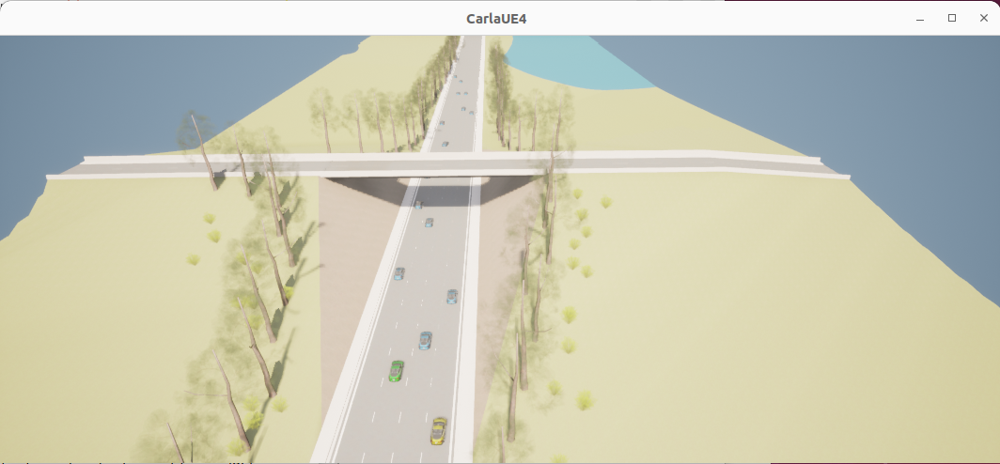
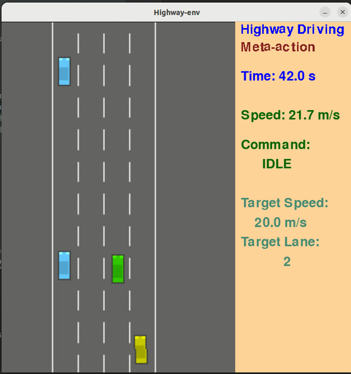

# Driving Simulator for reinforcement learning and imitation learning


This repository provides a driving simulator specifically for reinforcement learning or imitation learning. The scenario is generated based on [highway-env](https://github.com/eleurent/highway-env), where the MDP model of the highway driving scenario is naturally embedded. The 3-D rendering of the driving simulator is based Carla. (Without the installation of [Carla](https://github.com/carla-simulator/carla), you can still run the driving simulator on 2-D view). You can control one car with a keyboard or steering wheel & pedals. Moreover, you can share the road with your trained autonomous driving algorithm.

<p>
    
    <em>The customized map in Carla</em>
</p>

## What you can do with the codes
* **Data Collection for Training**: As a driving simulator, it can collect your driving data used for imitation learning. States and actions in MDP are recorded.
* **Testing the trained policy**: You can load your trained autonomous driving policy into one neighbor car and share the road with it. As a result, something interesting can be done. For example, you can play as a crazy driver and try to crash with the autonomous driving car to test its behavior in a corner case. 

## Key dependencies
* highway-env == 1.2.0
* gym == 0.15.4
* numpy == 1.16.6
* tensorflow == 1.14.0 (to load the pretrained autonomous driving policy, which is built in tensorflow)
* carla == 0.9.13


## How to run the codes
In order to use the 3-D animation feature, you need to install the Carla (and **also run the Carla server in a separate terminal**).  I have pre-built a Carla repository with the customized map on it (via Roadrunner). You can download my customized version via the google drive [link](https://drive.google.com/drive/folders/1KbLXIEchgGKb0GSAFAfnuCtPitfwwIOd?usp=sharing)

### Use the driving simulator to collect driving data 
* use the keyboard to control (arrow keys): ```python run_simulator_keyboard.py --carla False``` (2D) or ```python run_simulator_keyboard.py --carla True``` (3D)
* use the steering wheel and pedal to control: ```python run_simulator_pedal.py --carla False``` (2D) or ```python run_simulator_pedal.py --carla True``` (3D)

### Use the driving simultaor to play together with your trained autonomous vehicle
* use the keyboard to control (arrow keys): ```python run_simulator_keyboard_tp.py --carla False``` (2D) or ```python run_simulator_keyboard_tp.py --carla True``` (3D)
* use the steering wheel and pedal to control: ```python run_simulator_pedal_tp.py --carla False``` (2D) or ```python run_simulator_pedal_tp.py --carla True``` (3D)

### Tips
* You can adjust the size of the simulation screen via the arg ```ratio```, for example, ```python run_simulator_keyboard.py --ratio 0.5```
* To test your own autonomous driving algorithm, you can integrate your own trained policy network in this simulator
* The Logitech G29 steering wheels and pedals are used for this repository. It should also work with other Logitech steering wheels.

### Some screen captures

<p>
    
    <em>2D simulator (green car is controlled by human with keyboard, and yellow car is controlled by trained driving policy)</em>
</p>

<p>
    
    <em>3D simulator (green car is controlled by human with keyboard, and yellow car is controlled by trained driving policy)</em>
</p>


<p>
    
    <em>Human participant with driving simulator</em>
</p>

